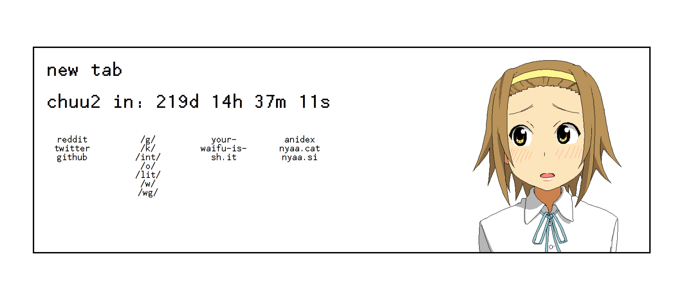
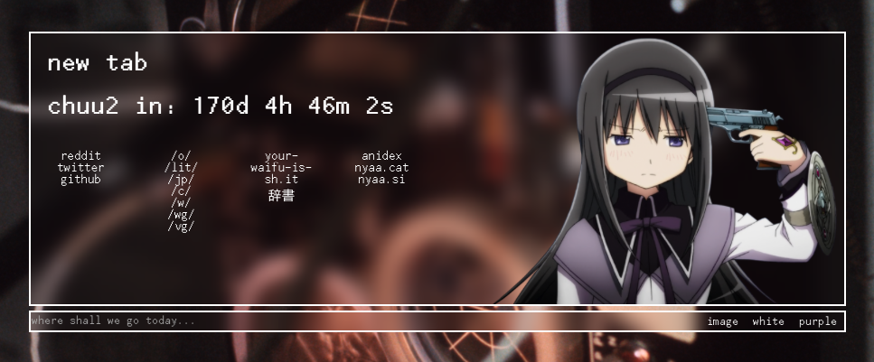

cool and good new tab page

## features
* simple and easy to modify
* mascots
* cool and useful countdown timer to Chuunibyou: Take On Me
* search bar with multiple engines
* dynamic colors and backgrounds
* click the upper h1 to choose a random mascot, click the lower h1 to hide

## searching
prefix a search with an engine from the `js/search.js` map, defaults are:
* wiki -- Wikipedia
* yt -- Youtube
* anidex
* nyaa
* jisho

like so `yt:mio is shaken for 10 hours` or `wiki:PDP-10` or `jisho:ドキドキ`

## themes
the HTML is pretty self explanatory, change the `$(document).ready` input onClick calls beneath the dynaColor function as you like, and the `<input>` tags at the bottom of the HTML to match

## mascots
add mascots in the mascots folder, and update `mascots.js` with a list of filenames

mascots should be transparent background PNGs or GIFs to work properly

